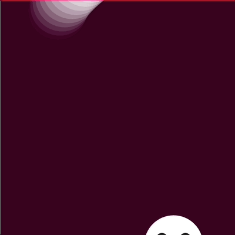

# cchi7170_9103_Week5Quiz

# Part 1: Imaging Technique Inspiration

1. Identify an Imaging Technique
- The imaging technique inspiration comes from this [Vincent Van Gough’s Starry night reimagined as an interactive app for iPad and android](https://www.youtube.com/watch?v=Ph1SEFWcL58) that turns the artwork into strokes.

2. Project Discussing
- The imaging technique above creates/recreates an artwork into many strokes and animates the strokes to move in certain directions of the art piece. The imaging technique can be used on the assignment for Edvard Munch's 'The Scream' or Claude Monet's 'Saint Georges majeur au crépuscule as both of the art pieces are mainly constructed by distinct lines. 

- The above example can be used for the individual task in our assignment where we need to develop an animated image as well. **Audio, Time-Based, and User Input** could be implemented to control the speed of the stroke movements.

3. Screenshots or Images
- Below shows a screenshot and a gif of the mentioned imaging technique


# Part 2: Coding Technique Exploration

1. Coding Technique
```
// Try changing these values!
const tailLength = 30;
const ghostSize = 100;
const wiggliness = 10;
const floatiness = 7;

let ghostX;
let ghostY;
const tail = [];

function setup() {
  createCanvas(400, 400);
  ghostX = width / 2;
  ghostY = height / 2;
}

function draw() {

  // The cos() function gives us a value that bounces between -1 and 1.
  // We can use that to create animations!
  ghostX += cos(frameCount / 10) * wiggliness;
  ghostY -= floatiness;

  // If the ghost goes above the top of the canvas, move it back to the bottom.
  if (ghostY < -ghostSize) {
    ghostY = height + ghostSize;
  }

  // Add a point to the beginning of the array.
  tail.unshift({x: ghostX, y: ghostY});
  // If the array is too big, remove the last point.
  if (tail.length > tailLength) {
    tail.pop();
  }

  background(64, 0, 32);
  noStroke();

  // Loop over the tail and draw the points.
  for (var index = 0; index < tail.length; index++) {
    const tailPoint = tail[index];

    // Tail gets smaller and more transparent.
    const pointSize = ghostSize * (tail.length - index) / tail.length;
    const pointAlpha = 255 * (tail.length - index) / tail.length;

    fill(255, pointAlpha);
    ellipse(tailPoint.x, tailPoint.y, pointSize);
  }

  // Draw the ghost's face.
  fill(32);
  ellipse(ghostX - ghostSize * .2, ghostY - ghostSize * .1, ghostSize * .2);
  ellipse(ghostX + ghostSize * .2, ghostY - ghostSize * .1, ghostSize * .2);
  ellipse(ghostX, ghostY + ghostSize * .2, ghostSize * .2);
}
```

2. Coding Technique Discussion
- The code above is from [Happy Coding](https://happycoding.io/tutorials/p5js/animation/ghost). It is an animation of a ghost that moves in a curve with designated lengths and sizes, and the "tail" of it will get smaller and more transparent so that it will disappear at certain lengths. 

- This technique can be used to create strokes with different colours for the artwork mentioned above. The animation of this technique can also be implied for the further variation of the assignment to match with the **Audio Frequency, Timers, or User Input** as a mouse click to change its speed or sizes by changing the variable *tailLength, ghostSize, wiggliness, floatiness* from the code provided above.

3. Inspiration
- A slight adjustment can be applied to the existing code above to change the "ghost's tail" from getting smaller to become a constant size of its head. Change ```ellipse(tailPoint.x, tailPoint.y, pointSize);``` to ```ellipse(tailPoint.x, tailPoint.y, ghostSize);```

4. Screenshots or Images Showcasing
- This is the ghost code from [Happy Coding](https://happycoding.io/tutorials/p5js/animation/ghost).


- With the slight change in 3. it comes...
